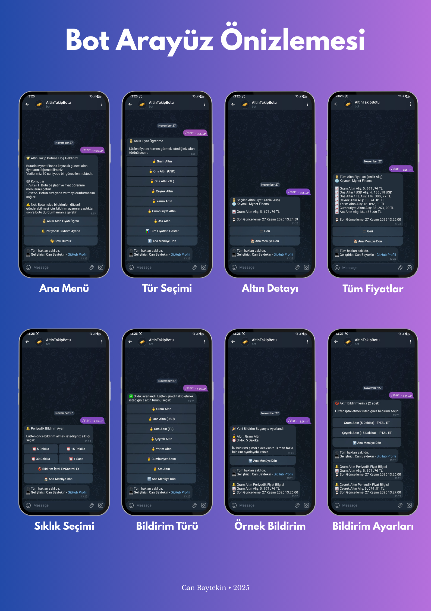

# 🥇 Altın Takip Botu

Telegram üzerinden **anlık altın fiyatlarını** sunan, **Dockerize** edilmiş ve **Google Cloud üzerinde çalışan** bir bot.  
Versiyon 2 ile bot artık **otomatik periyodik bildirimler** ve **geliştirilmiş menü deneyimi** sunuyor.

## 🎯 Amaç
Modern yazılım sürecini (**geliştirme → konteynerleştirme → bulut dağıtımı**) uçtan uca deneyimlemek ve sürdürülebilir, modüler bir proje geliştirmek amacıyla tasarlanmıştır.

## 🚀 Sürüm Notları
- **V1.0** - Menüden seçilen altın türünün anlık fiyatını gösterir.  
- **V2.0** - 
  - Kullanıcının seçtiği bildirim sıklığına göre otomatik altın fiyat bildirimi mekanizması eklendi.
  - Tasarımlar daha görsel ve kullanıcı dostu hâle getirildi.  
- **V2.0.1** - 
  - Geri bildirim mesajları iyileştirildi.  
  - Bazı menülerin buton tasarımları güncellendi.

## 🛠️ Teknoloji Seti

     
     
     

## 📱 Arayüz Önizlemesi
Telegram botunun menü akışı ve başlıca özelliklerini gösteren ekran görüntüleri.

  

## 🤖 Botu Deneyin
👉 [Altın Takip Botu - Telegram](https://t.me/AnlikAltinBot)
